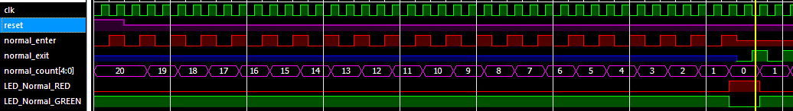
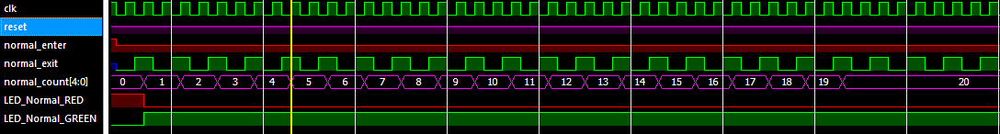
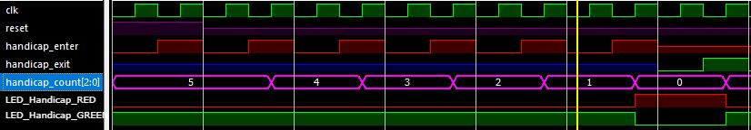
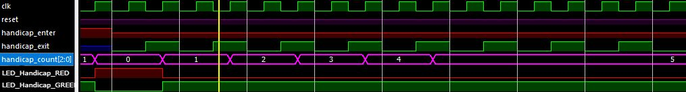
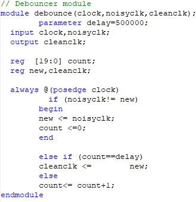
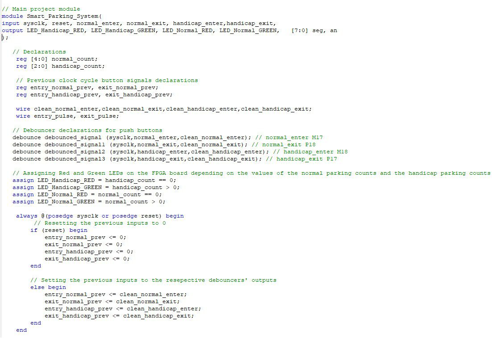
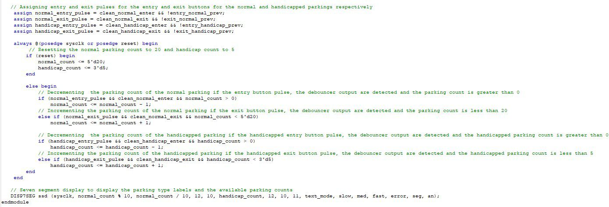

# Smart Parking System

A Verilog-based Smart Parking System implemented on FPGA to track and display the number of available parking slots for both **normal** and **handicapped** parking areas.

## Overview

This project was developed as a digital systems mini project. The system maintains separate parking-slot counters, debounces physical button inputs, detects entry and exit events, and displays real-time slot availability using LEDs and a seven-segment display.

The design supports:
- **Normal parking area** with a capacity of 20 slots
- **Handicapped parking area** with a capacity of 5 slots
- **Saturating counters** so the count never goes below zero or above the configured maximum
- **Status LEDs** to indicate whether parking is available
- **Seven-segment output** to visualize the current number of available slots

## Features

- Separate counters for normal and handicapped parking
- Saturating up/down counting logic
- Debounced push-button inputs for reliable hardware interaction
- Rising-edge detection for entry and exit events
- Seven-segment display integration
- LED indicators for parking availability:
  - **Green** = spots available
  - **Red** = full / no spots available

## System Behavior

- Pressing an **entry** button decrements the available-slot count when space exists
- Pressing an **exit** button increments the available-slot count until the maximum capacity is reached
- The system prevents underflow and overflow using saturating logic
- Each parking category is handled independently

## Design Modules

### 1. Smart Parking Top Module
Main control module responsible for:
- parking-slot counters
- input handling
- edge-based event processing
- LED status logic
- seven-segment interface connections

### 2. Debouncer Module
Filters noisy mechanical button inputs before they are processed by the control logic.

### 3. Edge Detection Logic
Generates a single-cycle pulse on button press so each press is counted once.

### 4. Display Logic
Uses a seven-segment display module to present the current counts for the parking areas.

## Tools and Technologies

- **Verilog HDL**
- **Xilinx Project Navigator (64-bit)**
- **FPGA board implementation**
- **UCF pin mapping**
- **Seven-segment display interface**
- **RGB / status LEDs**

## Verification

The project was verified through:
- simulation of saturating up/down counter behavior
- hardware-oriented debouncing logic
- edge-detection validation
- FPGA implementation checks for display correctness

## Snapshots

### Normal Parking - Saturating Down Counter

### Normal Parking - Saturating Up Counter

### Handicapped Parking - Saturating Down Counter

### Handicapped Parking - Saturating Up Counter

### Debouncer Module

### Smart Parking System Top Module - Part 1

### Smart Parking System Top Module - Part 2

## Teamwork

This project was completed as a **team-based implementation**. Work was divided across simulation, hardware-oriented Verilog development, seven-segment display integration, FPGA implementation, and report preparation. This repository intentionally omits personal names for privacy.
